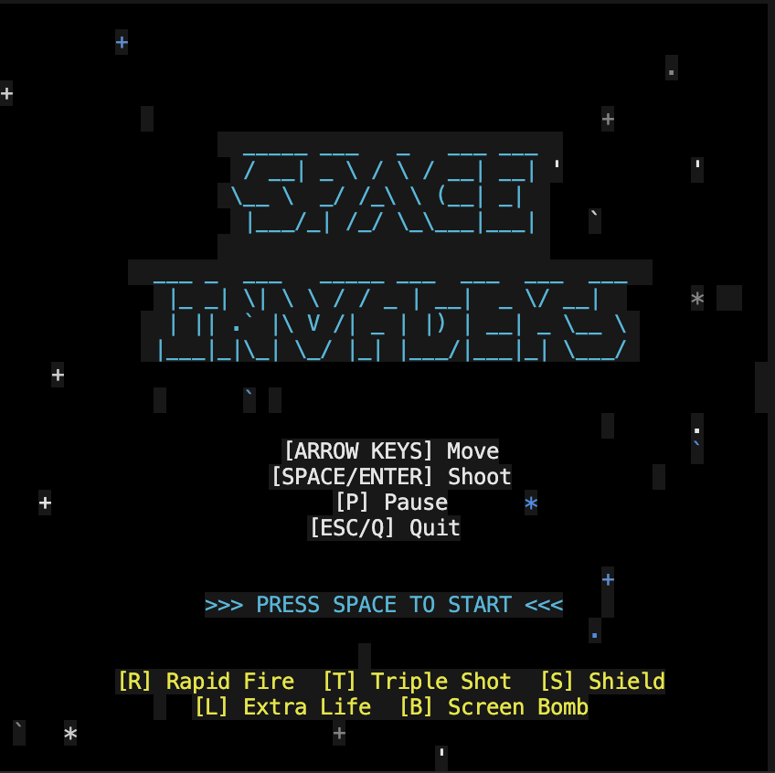

# Space Invaders

Terminal-based Space Invaders on steroids — full color, particle explosions, power-ups, multiple invader types, enemy fire, destructible barriers, combo scoring, and level progression. Built in Rust.



## Features

- **Full color rendering** — colored invaders, shots, explosions, and UI via crossterm
- **Particle explosion system** — burst effects on kills, big explosions on player hits, power-up collection sparkles
- **Animated starfield** — twinkling background stars for atmosphere
- **4 invader types** — Grunts (green), Soldiers (yellow), Elites (magenta), Commanders (red) with different point values and animation frames
- **Invaders shoot back** — enemy projectiles rain down from the bottom row
- **Destructible barriers** — 4 shields with 3 HP each, visually degrade as damaged
- **Power-up system** — 5 power-ups drop from kills:
  - `[R]` Rapid Fire — faster shots, more ammo
  - `[T]` Triple Shot — 3-way spread fire
  - `[S]` Shield — temporary invincibility bubble
  - `[L]` Extra Life — up to 5 lives
  - `[B]` Screen Bomb — instant kill all invaders
- **Combo scoring** — chain kills for 2x/3x/5x/10x multipliers
- **Multiple lives** — 3 lives with invincibility frames on hit
- **Level progression** — endless levels with increasing speed, more rows, faster enemy fire
- **Game states** — menu screen, pause, level-up transitions, game over, victory
- **Threaded rendering** — render loop on separate thread via `mpsc` channel
- **Delta-time updates** — frame-rate independent movement
- **WASD + Arrow keys** — dual control scheme

## Controls

| Key | Action |
|-----|--------|
| `Arrow Left` / `A` | Move left |
| `Arrow Right` / `D` | Move right |
| `Space` / `Enter` | Shoot |
| `P` | Pause |
| `Esc` / `Q` | Quit |

## Build & Run

```bash
# Requires Rust toolchain (https://rustup.rs)
cargo run --release
```

## Tech Stack

- **Rust** 2021 edition
- **crossterm** — terminal control, colors, cursor
- **rusty_audio** — WAV audio playback
- **rusty_time** — timer utilities for delta-time
- **rand** — randomized enemy fire, power-up drops, starfield

## Project Structure

```
src/
├── main.rs                 # Game loop orchestration, state machine
├── lib.rs                  # Module declarations, constants
├── frame.rs                # Cell struct (char + color), Frame type, Drawable trait
├── game/
│   ├── mod.rs
│   ├── state.rs            # GameState enum, state transitions
│   ├── score.rs            # Score tracking, combo multipliers
│   └── level.rs            # Level config (speed, rows, difficulty scaling)
├── entities/
│   ├── mod.rs
│   ├── player.rs           # Player: lives, power-ups, shield, shooting
│   ├── invader.rs          # InvaderType enum (Grunt/Soldier/Elite/Commander)
│   ├── invaders.rs         # Invader army: movement, AI shooting, level setup
│   ├── shot.rs             # Player projectiles (Normal/Rapid/Triple)
│   ├── enemy_shot.rs       # Enemy projectiles
│   ├── barrier.rs          # Destructible barriers with HP
│   └── powerup.rs          # Power-up items and active power-up tracking
├── effects/
│   ├── mod.rs
│   ├── particles.rs        # Particle explosion system
│   └── stars.rs            # Animated starfield background
├── render/
│   ├── mod.rs
│   ├── renderer.rs         # Color-aware diff-based terminal renderer
│   ├── color.rs            # Theme system (neon color palette)
│   ├── hud.rs              # Score, lives, level, combo display
│   └── menu.rs             # Menu, pause, game over, victory, level-up screens
├── audio/
│   ├── mod.rs
│   └── manager.rs          # Audio playback wrapper
├── input/
│   ├── mod.rs
│   └── handler.rs          # Input polling, GameAction enum
*.wav                       # Sound assets (startup, pew, explode, move, win, lose)
```
